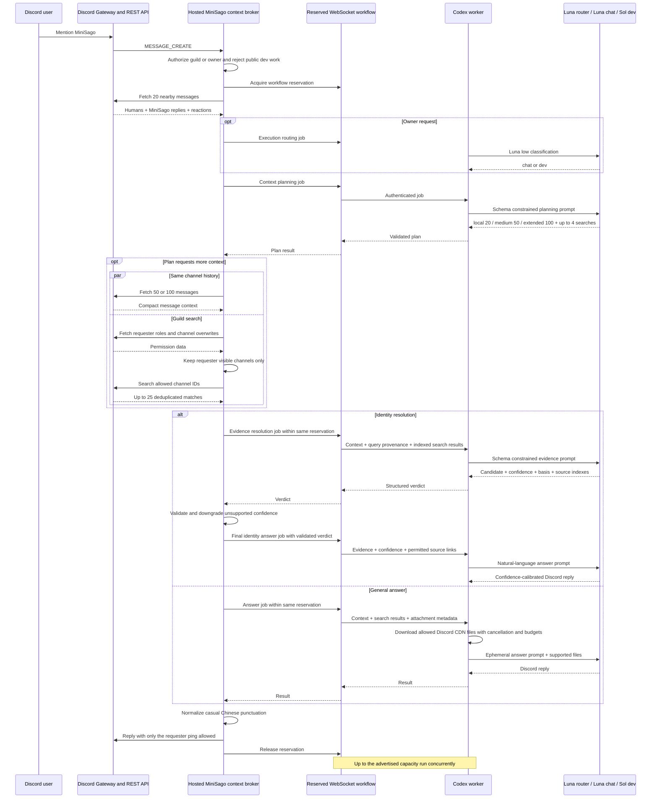

# Operations

This document covers setup, maintenance commands, runtime endpoints, Discord
installation permissions, and deployment. The user-facing feature overview lives
in [README.md](../README.md).

## Feature boundaries

- **Universal:** Instagram link replies run in every server and channel where
  MiniSago has the required message permissions. Hsi's chatbot mentions work in
  those locations and in direct messages when a Codex worker is available.
- **Chatbot guilds:** every member of guilds `917436845187563610` and
  `1282936453134815275` can mention MiniSago and use the chatbot.
- **Chatbot channel:** every member with access to channel
  `1517766866964316201` can mention MiniSago and use the chatbot there.
- **Configured guild:** the channel access panel, Wordle/Brawl Stars commands,
  TOEFL posts, Gamer forum alerts, and X alerts are restricted to
  `DISCORD_GUILD_ID`. The current deployment uses the WM31 guild
  `1282936453134815275`.
- **Configured repository/channel:** the GitHub webhook bridge accepts only
  `Hsiii/health-check-system` pull request events and posts only to
  `GITHUB_PR_THREAD_CHANNEL_ID`.

Installing MiniSago in another server does not expose or activate the WM31 role
controls or scheduled feeds there.

## Local setup

1. Install dependencies and copy `.env.example` to `.env.local`.
2. Set `DISCORD_APPLICATION_ID`, `DISCORD_PUBLIC_KEY`, and `DISCORD_BOT_TOKEN`.
3. Set `DISCORD_GUILD_ID` for the one server allowed to use configured-guild
   features, and optionally set `SELF_ASSIGNABLE_ROLES`. The checked-in defaults
   target the WM31 Wordle and Brawl Stars roles and should not be treated as
   universal examples.
4. Enable the Message Content privileged intent in the Discord Developer Portal
   under Bot -> Privileged Gateway Intents if universal Instagram link replies
   should run. Without it, Discord closes the Gateway connection with code
   `4014` and Instagram messages cannot be read.
5. Sync the Discord application install settings so the bot profile
   `Add App` / `Add to Server` flow requests `applications.commands`, `bot`,
   `View Channels`, `Send Messages`, `Manage Messages`, `Read Message History`,
   `Manage Roles`, `Create Public Threads`, `Send Messages in Threads`, and
   `Manage Threads`.
6. Publish the slash commands.
7. Publish the channel access panel. Pass a channel ID or set
   `DISCORD_CHANNEL_ACCESS_CHANNEL_ID`.
8. Optionally set `TOEFL_VOCAB_CHANNEL_ID` to post one vocabulary item per day.
   The Gamer forum monitor defaults to channel `1518127531968958558`; override
   `GAMER_FORUM_CHANNEL_ID` only if it should post elsewhere.
   The X post monitor defaults to `@thsottiaux` and channel
   `1527893157168283668`.
9. To enable PR review threads, set `GITHUB_WEBHOOK_SECRET`, install MiniSago in
   the server containing `GITHUB_PR_THREAD_CHANNEL_ID`, and configure the
   repository webhook described below.
10. Run locally or deploy, then point the Discord Interactions Endpoint URL at
    `/api/interactions`.
11. To enable the private chatbot, configure the same
    `MINISAGO_MAC_BRIDGE_SECRET` in production and `.env.local`, deploy the
    hosted bridge, then install a worker as described below.

If production already uses the same bot token, set
`DISCORD_GATEWAY_DISABLED=true` locally before running the development server.
Discord delivers Gateway events to every connected unsharded instance, so a
second listener can produce duplicate replies. HTTP interactions and local
endpoint development continue to work with the Gateway disabled.

```bash
bun install
bun run sync:install
bun run register:commands
bun run publish:panel -- 1520033288767537263
bun run dev
```

## Instagram link replies

The Instagram feature is a universal Gateway listener, not a Discord webhook.
For each non-bot server message containing an `instagram.com` URL, MiniSago:

1. leaves the user's message untouched;
2. converts each Instagram URL to the matching `kkinstagram.com` URL; and
3. replies to the original message with only the converted URL or URLs.

MiniSago ignores bot and webhook-authored messages to avoid loops. It does not
need Manage Messages or Manage Webhooks, and there should be no MiniSago or
`WM31 Instagram` entries under Server Settings -> Integrations -> Webhooks.

If messages are deleted or reappear under a user's display name, a retired
webhook-based instance is still running. Stop that duplicate deployment first,
then delete its webhook from Server Settings -> Integrations -> Webhooks. Keep
exactly one Gateway-enabled MiniSago instance running for a bot token.

The Gateway connection is outbound, so Instagram replies do not require a
public webhook endpoint. The `/api/interactions` endpoint is still required for
slash commands and channel access components.

## Codex chatbot

### Runtime architecture



The hosted process receives `@MiniSago` messages from any member of the two
chatbot guilds or the allowed chatbot channel through the existing Discord
Gateway. Hsi retains access in other visible servers and direct messages. In a
guild, it first fetches up to 20
nearby human messages plus MiniSago's own prior replies and sends a transient
context-planning job through the authenticated WebSocket at
`/api/mac-agent/ws`. Message context includes compact reaction emoji and counts,
but not the list of members who reacted. There is no polling, public Mac
endpoint, or durable queue.

Natural requests to find an older message use Discord's official guild message
search endpoint. Codex returns a JSON Schema-constrained plan that chooses the
nearby window or 50/100 same-channel messages and may add up to four guild
searches using bounded text, sender, link, file, media, embed, hostname, and
attachment-type filters. Each query carries its retrieval purpose so matching
messages retain evidence provenance after deduplication. MiniSago validates the
plan, performs same-channel and guild reads in parallel, resolves a named
sender—or the requester from “I” and “我”—and excludes the triggering message.
Guild search is
restricted to channels where the requester has View Channel and Read Message
History; if role data is unavailable, it falls back to the current channel. The
answer run receives compact message records plus up to 25 guild matches with
channel names and original Discord jump links. A jump link acts as the safe
repost path without copying or re-uploading someone else's attachment. Discord
requires View Channel, Read Message History, and the Message Content privileged
intent for these reads.

Identity questions use a separate schema-constrained evidence resolver instead
of the freeform answer prompt. It distinguishes direct self-links, independent
corroboration, third-party claims, conflicts, and missing evidence. The hosted
process always attempts a guild-member lookup plus searches for messages written
by and mentioning that member. It supplies each author's distinct server
nickname, global display name, and username, bounds source indexes, downgrades
unsupported confidence, and sends the validated verdict to a separate answer
run. That run chooses natural wording based on the confidence level rather than
using a fixed reply template. A lone claim that two aliases are equal can
therefore be reported only as uncertain.
Before any chatbot response is posted, formal Chinese punctuation is normalized
into spaces and line breaks while technical syntax and links remain available.

The worker runs chat jobs on `gpt-5.6-luna` with high reasoning and live public
web search. Hsi's requests first pass through a Luna-low execution router;
dev-mode jobs then run on `gpt-5.6-sol` with medium reasoning. Each run is
ephemeral. Codex receives only the current transcript and
up to 10 relevant supported attachments of at most 20 MB each and 40 MB total.
Images, PDFs, DOCX, and common text formats are supported. Downloads accept
only Discord's HTTPS CDN hosts and stop when the request is cancelled. Temporary
files are removed after the run, and output is shortened to one Discord message.

Chat mode uses an isolated workspace and Codex home, a restrictive permission
profile, and—on macOS—a process sandbox that prevents Codex from launching
child processes. Normal Codex configuration, memories, MCP servers, plugins,
and private browser sessions remain unavailable. Owner dev mode enables
developer tools and network access inside `MINISAGO_WORKSPACE_ROOT`; on Oracle,
the container is the outer security boundary.

Each worker advertises a bounded concurrency value, defaulting to two. The
hosted bridge can reserve that many independent Discord workflows per worker
while still keeping each workflow's planning and answer stages sequential.
Workers also register a stable ID, capabilities, and priority. The bridge
prefers Oracle for `chat` and `dev`, falls back to another compatible worker
when Oracle is full or offline, and pins the remaining stages after Luna picks
the execution target. A request that explicitly needs a Mac resource is moved
to a connected worker advertising `mac`.

For owner dev answers, optional GitHub access uses the `gh` CLI's own persistent
login. Router, planner, community, and chat processes cannot execute developer
commands. Canonical clones persist under
`MINISAGO_GITHUB_REPOSITORY_ROOT`; concurrent changes use a job-specific
directory under `MINISAGO_GITHUB_WORKTREE_ROOT`. Sol is required to push only a
feature branch and open a draft PR, never push a protected branch or merge.
Ordinary chat stages retain the two-minute timeout; final owner dev answers may
run for up to fifteen minutes for cloning, tests, builds, and PR preparation.

### Oracle ARM worker

Use a normal OCI Ampere A1 Compute VM, not Container Instances. A Compute VM
provides persistent Docker volumes and is explicitly covered by OCI's A1 Always
Free allowance; Container Instances have ephemeral container storage and a
different billing model. Oracle's current Arm page states 3,000 A1 OCPU-hours
and 18,000 GB-hours per tenancy each month, while its Always Free inventory page
still states 1,500 and 9,000. Size against the lower 2-OCPU/12-GB figure until
the Limits, Quotas and Usage page for the actual tenancy confirms otherwise.
The checked-in worker Dockerfile is multi-architecture: it builds AMD64 on the
current x86 VM and ARM64 on an A1 VM without emulation. Codex auth, traces, and
cloned repositories stay outside the image.

Recommended split:

- Oracle runs both Luna and Sol for Discord, web, GitHub, repository, test, and
  build work. This gives MiniSago the Hermes-like always-on behavior.
- Mac advertises `chat,dev,mac` at a lower priority. It remains connected as a
  fallback and receives work directly when Luna determines that local Mac
  files, apps, browser state, or hardware are required.

On the current VM, or after provisioning an Ubuntu AArch64
`VM.Standard.A1.Flex` VM, install Docker Engine with the Compose plugin, clone
this repository, then run:

```bash
cp .env.worker.example .env.worker
mkdir -p workspace/repositories workspace/worktrees
chmod 700 workspace workspace/repositories workspace/worktrees .env.worker
docker compose -f compose.worker.yaml build
docker compose -f compose.worker.yaml run --rm worker codex login --device-auth
docker compose -f compose.worker.yaml up -d
docker compose -f compose.worker.yaml logs -f worker
```

Cloud Sol GitHub work is blocked on
[issue #12](https://github.com/Hsiii/mini-sago/issues/12). The repository list
is prompt-only routing context and does not restrict the mounted `gh` login.
Do not enable the cloud worker's `dev` capability with a broad persistent login
until the external repository/operation policy and job-scoped credentials are
implemented.

For a temporary operator-controlled rehearsal only, set
`MINISAGO_GITHUB_REPOSITORIES` in `.env.worker`, then authenticate GitHub CLI
through its normal browser flow.
The login is written to the persistent `minisago-github` volume; do not paste a
token into Discord, a Codex task, `.env.worker`, or the repository:

```bash
docker compose -f compose.worker.yaml run --rm worker gh auth login --hostname github.com --git-protocol https --web
docker compose -f compose.worker.yaml up -d --force-recreate worker
docker compose -f compose.worker.yaml exec worker gh auth status
```

The worker's GitHub CLI login and Codex login use separate persistent volumes.
See [Configuration](configuration.md#owner-github-automation) for the runtime
boundary.

Put the production bridge URL and the same 32-byte-or-longer bridge secret in
`.env.worker` before login. Device auth writes only to the persistent
`minisago-codex` volume; never copy it into the image or repository. OpenAI
supports ChatGPT sign-in and device auth for headless Codex, but recommends API
keys for unattended automation. A Pro login therefore works as the requested
starting point, while reauthentication and plan limits remain operational
dependencies rather than uptime guarantees.

Oracle also documents that idle Always Free compute can be reclaimed after a
seven-day low-utilization window. Use a paid/PAYG instance if strict uptime is
more important than staying entirely inside Always Free; artificial keepalive
load is not part of this deployment.

The worker needs outbound HTTPS and WSS only. Do not expose Docker, Codex, SSH,
or a workspace volume publicly. Confirm the resulting image uses the VM's
native architecture with:

```bash
docker image inspect minisago-worker --format '{{.Architecture}}'
```

OCI references: [Ampere A1 Compute](https://docs.oracle.com/en-us/iaas/Content/Compute/References/arm.htm),
[Always Free resources](https://docs.oracle.com/en-us/iaas/Content/FreeTier/freetier_topic-Always_Free_Resources.htm),
and [multi-architecture containers](https://docs.oracle.com/en-us/iaas/Content/ContEng/Tasks/contengrunningarmnodes.htm).
OpenAI authentication reference: [Codex authentication](https://developers.openai.com/codex/auth).

### Install the Mac helper

Prerequisites:

- Bun and the Xcode command-line tools, including `swiftc`.
- A working local Codex login: the installer expects `~/.codex/auth.json`.
- The same random `MINISAGO_MAC_BRIDGE_SECRET` in `.env.local` and the hosted
  `bot-core` environment.
- The hosted service deployed with WebSocket upgrade support at
  `/api/mac-agent/ws`.

Run:

```bash
bun run mac-agent:install
bun run mac-agent:status
```

The installer compiles a small native session monitor and registers
`dev.hsichen.minisago-mac-agent` as a per-user LaunchAgent. It connects only
while the session is unlocked, disconnects before sleep or on lock, reconnects
after unlock, and starts automatically at login. A display sleeping without a
session lock does not disable it.

Metadata-only logs live under
`~/Library/Application Support/MiniSago/logs`. They contain job IDs, timestamps,
durations, availability, and failures—not prompts, Discord messages, answers,
links, or attachment contents.

Debuggable response traces live separately at
`~/Library/Application Support/MiniSago/traces.sqlite`. They correlate the
planning and answering jobs for each Discord request and retain the supplied
message context, sanitized attachment metadata, planner output, search-result
context, model output, errors, and timings. Signed attachment URL parameters
and downloaded attachment bodies are never stored. Traces are owner-readable
only, expire after 14 days, and are also pruned oldest-first if the database
exceeds 250 MB. Cleanup runs at helper startup and at least daily while jobs are
handled. Asking MiniSago a natural follow-up such as “how did you decide?” or
“你剛剛為什麼這樣回答？” returns a conversational summary of the latest completed
trace in that channel; it does not expose private model chain-of-thought.

To stop and remove the helper, its secret file, compiled monitor, logs, and
response traces:

```bash
bun run mac-agent:uninstall
```

Uninstalling does not change the normal `~/.codex` login or configuration.

## Endpoints

- `GET /api/health` returns configuration health plus aggregate connected,
  available, capacity, and active worker counts. Worker IDs are not exposed.
- `GET /api/mac-agent/ws` upgrades an authenticated Codex worker connection to a
  WebSocket. It returns `404` when the bridge secret is not configured.
- `POST /api/interactions` handles Discord slash commands and panel
  components.
- `POST /api/github/webhook` verifies and handles GitHub pull request events.

## GitHub pull request webhook

In `Hsiii/health-check-system` under Settings -> Webhooks, add a repository
webhook with:

- Payload URL: `https://bot.hsichen.dev/api/github/webhook`
- Content type: `application/json`
- Secret: the same random value as `GITHUB_WEBHOOK_SECRET`
- Events: select only **Pull requests**

The `ready_for_review` action creates a public thread named after the PR, posts
the review request, and pins that message so the PR link stays easy to find.
Repeated deliveries reuse the saved thread instead of creating duplicates. A
`closed` action archives the thread only when GitHub marks the PR as merged.

The production bridge is deployed at `bot.hsichen.dev`. MiniSago's access to
the `專案討論` text channel (`1521506395034226830`) in guild
`1521168712579682567` has been verified for viewing, sending messages, reading
history, creating public threads, sending in threads, and managing threads.

## Admin and maintenance utilities

- `bun run sync:install` updates Discord's Guild Install defaults with the
  scopes and permissions the bot needs.
- `bun run register:commands` publishes the channel-role slash commands to
  `DISCORD_GUILD_ID`. Omitting it publishes the commands globally, but the
  runtime still rejects them outside its configured guild; normal deployments
  should therefore always set the guild ID.
- `bun run publish:panel` creates or updates the channel access panel in a
  chosen Discord channel.
- `bun run fetch:vocab` fetches candidate Wiktionary data for expanding the
  checked-in TOEFL vocabulary dataset.
- `bun run mac-agent:install`, `mac-agent:status`, and `mac-agent:uninstall`
  manage the unlocked-session Codex helper on this Mac.

To fetch raw Wiktionary definitions for new words, run:

```bash
bun run fetch:vocab -- abate adapt analyze
```

Review the generated output before replacing or appending to
`data/toefl-vocab.json`; Wiktionary definitions are broad, so TOEFL-friendly
examples and Traditional Chinese explanations should stay human-reviewed.

## Discord install permissions

Discord's bot profile `Add App` flow uses the application-level Guild Install
Default Install Settings, not README invite text. Run `bun run sync:install`
after setting `DISCORD_APPLICATION_ID` and `DISCORD_BOT_TOKEN` to update those
settings through the Discord API. In the Developer Portal, keep
Installation -> Install Link set to `Discord Provided Link` so the profile
button uses these defaults.

The synced permission bitfield is `326686026752`, which includes:

- `View Channels`
- `Send Messages`
- `Manage Messages`
- `Read Message History`
- `Manage Roles`
- `Manage Threads`
- `Create Public Threads`
- `Send Messages in Threads`

The integer is used by Discord's API and generated install URL; Server Settings
does not provide an integer field. For an existing installation, open Server
Settings -> Roles -> 迷你西米露 and configure the corresponding permission
checkboxes. Application install defaults affect new installations and do not
retroactively rewrite an existing server role.

`View Channels`, `Send Messages`, and `Read Message History` support universal
Instagram replies and owner chatbot context. `Manage Roles` is needed only for
the configured-guild channel access commands and panel. `Manage Messages` lets
the GitHub bridge pin each review request. The thread permissions let the bridge
create public threads, add team members, post review requests, and archive
threads after merge. MiniSago does not request Manage Webhooks. Channel-specific
overrides must still allow the relevant permissions in each target channel.

Servers that only use universal Instagram replies may disable Manage Roles for
MiniSago. That does not affect link replies; it only prevents the configured
channel-role feature, which is not available outside `DISCORD_GUILD_ID` anyway.

For role assignment to work, the bot's highest role in each server must still
be above the self-assignable channel roles in Server Settings -> Roles.

## Production deployment

Every push to `main` publishes Linux AMD64 and ARM64 images to GitHub Container
Registry. The workflow maintains a moving `main` tag and an immutable
`sha-<commit>` tag for both images:

```text
ghcr.io/hsiii/minisago
ghcr.io/hsiii/minisago-worker
```

Changes must reach `main` through a pull request. `bun run deploy` never pushes
code: it requires a clean local `main` whose HEAD exactly matches
`origin/main`, waits for that commit's image workflow, and asks the Sago Cloud
operations checkout at `/srv/sago-cloud/operations` to deploy both the neutral
`bot-core` service and the always-on Codex worker as one MiniSago release:

```bash
bun run deploy
```

The VM pulls both published images rather than cloning or building this
repository. Production configuration lives under `/srv/sago-cloud/secrets`; only
the core container joins the external `sago_cloud_edge` network under the
`bot-core` alias. The worker keeps Codex, GitHub CLI, state, repositories, and
worktrees in external persistent volumes managed by Sago Cloud operations
repository.

The deployment command retries SSH connection timeouts three times. It reaches
the VM through the local `sago-cloud` SSH alias, which must resolve over
Tailscale. If it still cannot reach `sago-cloud`, confirm the local device is on
the shared tailnet and that `ssh sago-cloud` succeeds, then rerun the command.
Use `SAGO_CLOUD_HOST` to target a replacement host.

Confirm the public endpoints after deployment:

```bash
curl https://bot.hsichen.dev/api/health
```

```text
https://bot.hsichen.dev/api/interactions
https://bot.hsichen.dev/api/github/webhook
wss://bot.hsichen.dev/api/mac-agent/ws
```

The edge proxy must preserve WebSocket upgrade headers for the Mac bridge.

Sago Cloud caps the bot at 0.25 CPU and 256 MB RAM. Scheduled-post state is
stored in the external `sago_cloud_bot-core-state` volume:

- TOEFL state when `TOEFL_VOCAB_STATE_FILE` is set to
  `/app/state/toefl-vocab-state.json`.
- Gamer forum state through the Compose-level `GAMER_FORUM_STATE_FILE` default
  of `/app/state/gamer-forum-state.json`.
- X post state when `X_POST_STATE_FILE` is set to
  `/app/state/x-post-state.json`.
- GitHub PR thread state when `GITHUB_PR_THREAD_STATE_FILE` is set to
  `/app/state/github-pr-threads.json`.
