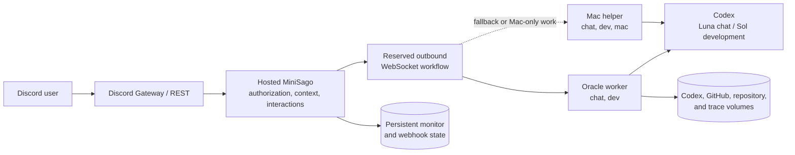

# Operations

This runbook records setup outside the repository, credential handling,
production topology, privacy guarantees, and recovery details. Commands and
mechanical defaults remain discoverable in `package.json`, the environment
examples, Compose, and deployment scripts. The user-facing overview lives in
[README.md](../README.md).

## Deployment structure



The hosted service owns Discord access, authorization, context retrieval,
scheduled posts, and webhook handling. Workers make authenticated outbound
connections to it; no worker port should be public. Each Discord workflow stays
on one reserved worker until its routing, planning, and answer stages finish.
Oracle is the preferred always-on worker, while the unlocked Mac is a
lower-priority fallback and the only worker allowed to advertise local Mac
access.

## Discord setup

1. Run `bun install`, copy `.env.example` to `.env.local`, and provide the
   Discord application ID, public key, and bot token.
2. In the Discord Developer Portal, enable Bot -> Privileged Gateway Intents ->
   Message Content. Without it, Discord closes the Gateway with code `4014` and
   cannot deliver message content for link replies or chatbot context.
3. Keep Installation -> Install Link set to `Discord Provided Link`, then run
   `bun run sync:install`. Discord uses the application's Default Install
   Settings for the bot profile's Add App flow; README invite text does not
   control it.
4. Run `bun run register:commands` with `DISCORD_GUILD_ID` set. The runtime
   rejects configured-guild commands elsewhere even if they are registered
   globally.
5. Optionally run `bun run publish:panel -- <channel-id>` for configured-guild
   role access and configure any scheduled monitors in `.env.local`.
6. Run `bun run dev` locally, or deploy the hosted service.
7. Point the Interactions Endpoint URL at
   `<public-origin>/api/interactions`. The current production origin is
   `https://bot.hsichen.dev`.
8. Configure a worker secret on both sides, then connect either the Oracle
   worker or Mac helper.

The synced permission bitfield is `326686026816`, containing:

- Add Reactions
- View Channels
- Send Messages
- Manage Messages
- Read Message History
- Manage Roles
- Manage Threads
- Create Public Threads
- Send Messages in Threads

Manage Roles is needed only for configured-guild role access. Manage Messages
pins PR review requests, and the thread permissions support review discussions.
Add Reactions is used only when ambient reactions are enabled. MiniSago does
not require Manage Webhooks. Application defaults affect new installs only;
update the existing bot role and channel overrides manually. For role
assignment, the bot's highest role must remain above every self-assignable role.

Only one Gateway-enabled deployment may use a bot token. Set
`DISCORD_GATEWAY_DISABLED=true` for local HTTP development while production is
connected. If Instagram messages are deleted or reappear under a user's display
name, stop the retired webhook-based deployment and remove its webhook under
Server Settings -> Integrations -> Webhooks.

## Worker architecture and privacy

The hosted service is a context broker; Codex runs behind an authenticated
outbound WebSocket connection. There is no public worker endpoint or durable
job queue. A workflow reserves one worker for routing, any MCP-backed evidence
resolution, and the final answer, then releases it.

The service exposes one Streamable HTTP MCP route for workers. It accepts only
opaque bearer tokens created for an active chatbot workflow. Each token is
bound in memory to the real requester and Discord permission context, expires
after 16 minutes, and is revoked when the workflow finishes. MCP arguments
cannot select a requester, guild, channel, worker capability, or mutation scope.

Guild searches are restricted to channels where the requester has View Channel
and Read Message History. If role data is unavailable, search falls back to the
current channel. Member roles, join dates, presence, and reaction-member lists
are not sent to Codex.

Each Codex run is ephemeral. It receives the selected message context and at
most 10 supported attachments, 20 MB each and 40 MB total. Downloads accept only
Discord HTTPS CDN hosts, stop when the request is cancelled, and are deleted
afterward. Normal Codex configuration, memories, user-configured MCP servers,
plugins, and private browser sessions are unavailable. Answer jobs receive only
MiniSago's curated Discord MCP tools.

Chat runs in an isolated workspace with restricted permissions. Owner
development enables commands and network access only inside a selected
disposable checkout; the container remains the outer boundary on Oracle.
The Linux worker selects Codex's legacy Landlock sandbox because Bubblewrap
cannot create its nested user namespace inside the unprivileged container.
Provider and production credentials are not mounted. Ordinary chat stages have
a two-minute timeout; final owner development answers may run for 15 minutes.

## Oracle worker

Use an OCI Ampere A1 Compute VM rather than Container Instances because the
worker requires persistent Docker volumes. Confirm current capacity, pricing,
and reclamation policy in the OCI console and official documentation rather
than relying on values copied into this repository.

The intended split is:

- Oracle runs one higher-priority `chat,dev` worker with separate Codex and
  dedicated GitHub CLI volumes.
- Mac advertises lower-priority `chat,dev,mac`, acts as fallback, and handles
  work that explicitly needs local resources.

On the Ubuntu AArch64 VM, install Docker Engine with the Compose plugin, clone
the repository, and configure `.env.worker`:

```bash
cp .env.worker.example .env.worker
chmod 600 .env.worker
docker compose -f compose.worker.yaml build
docker compose -f compose.worker.yaml run --rm worker codex login --device-auth
docker compose -f compose.worker.yaml up -d
docker compose -f compose.worker.yaml logs -f worker
```

Set the exact repository allowlist in `MINISAGO_GITHUB_REPOSITORIES`. Put the
repository that implements chatbot behavior in `MINISAGO_CHATBOT_REPOSITORY`
when the allowlist has more than one entry. Repositories are cloned into a
disposable worktree on first use and do not need to exist locally beforehand. Put the
same 32-byte-or-longer secret in the worker's
`MINISAGO_MAC_BRIDGE_SECRET` and the hosted broker's
`MINISAGO_WORKER_BRIDGE_SECRET`. Device authentication must write only to the
persistent Codex volume.

Authenticate the dedicated GitHub login by passing its fine-grained token to
`gh` over standard input. Never place the token in Discord, a Codex task,
`.env.worker`, a shell argument, or the repository:

```bash
docker compose -f compose.worker.yaml run --rm worker gh auth login --hostname github.com --git-protocol https --with-token
docker compose -f compose.worker.yaml up -d --force-recreate
docker compose -f compose.worker.yaml exec worker gh auth status
```

The worker needs outbound HTTPS and WSS only. Do not publicly expose Docker,
Codex, SSH, or workspace volumes. ChatGPT device authentication can require
reauthentication and remains subject to plan limits; it is not an uptime
guarantee.

## Runtime endpoints

| Endpoint                   | Purpose                                                                   |
| -------------------------- | ------------------------------------------------------------------------- |
| `GET /api/health`          | Configuration health and aggregate worker availability/capacity           |
| `GET /api/mac-agent/ws`    | Authenticated worker WebSocket; returns `404` when the bridge is disabled |
| `POST /api/interactions`   | Discord slash commands and components                                     |
| `POST /api/github/webhook` | Verified GitHub pull-request events                                       |

Expose the HTTP endpoints through the hosted service. Preserve WebSocket
upgrade headers for `/api/mac-agent/ws`; workers connect outbound to it.

## Mac helper

Prerequisites are Bun, Xcode command-line tools including `swiftc`, an existing
`~/.codex/auth.json`, and the same `MINISAGO_MAC_BRIDGE_SECRET` on the helper and
hosted service. The edge must preserve WebSocket upgrades for
`/api/mac-agent/ws`.

Authenticate the isolated GitHub login, then install:

```bash
GH_CONFIG_DIR="$HOME/Library/Application Support/MiniSago/github" gh auth login --hostname github.com --git-protocol https --with-token
bun run mac-agent:install
bun run mac-agent:status
```

The per-user LaunchAgent `dev.hsichen.minisago-mac-agent` connects only while
the session is unlocked, disconnects before sleep or lock, and reconnects after
unlock. It starts automatically at login. Display sleep without a session lock
does not disconnect it.

Metadata-only logs live under
`~/Library/Application Support/MiniSago/logs`; they exclude prompts, Discord
messages, answers, links, and attachment contents. Debug traces live at
`~/Library/Application Support/MiniSago/traces.sqlite`. They may contain message
context, sanitized attachment metadata, bounded MCP tool names and arguments,
model output, errors, and timings, but never MCP bearer tokens, signed URL
parameters, tool-result message bodies, or downloaded attachment bodies. They
are owner-readable, expire after 14 days, and are pruned oldest-first above
250 MB.

`bun run mac-agent:uninstall` removes the helper, its secret, compiled monitor,
logs, traces, and isolated GitHub logins. It does not modify the normal
`~/.codex` or `~/.config/gh` state.

## GitHub review webhook

In the configured GitHub repository -> Settings -> Webhooks, configure:

- Payload URL: `<public-origin>/api/github/webhook`
- Content type: `application/json`
- Secret: the value of `GITHUB_WEBHOOK_SECRET`
- Events: Pull requests only

The production Discord destination is the `專案討論` channel
`1521506395034226830` in guild `1521168712579682567`. MiniSago has been verified
there for viewing, sending, reading history, creating public threads, sending in
threads, and managing threads. The state file must persist so repeated webhook
deliveries reuse threads and merged pull requests archive the correct thread.

## Production deployment

Every push to `main` publishes Linux AMD64 and ARM64 images with a moving `main`
tag and immutable `sha-<commit>` tags:

```text
ghcr.io/hsiii/minisago
ghcr.io/hsiii/minisago-worker
```

For a general self-host, run the core image with the hosted-service variables,
persist `/app/state`, expose container port `3000` through an HTTPS reverse
proxy, and run at least one separately authenticated worker. Replace every
`bot.hsichen.dev` example in the environment files with that public origin.

The remaining deployment procedure is specific to Hsi's Sago Cloud:

Changes reach production through `main`. `bun run deploy` requires a clean local
`main` matching `origin/main`, waits for that commit's published images, then
asks the Sago Cloud operations checkout at `/srv/sago-cloud/operations` to
deploy the core service and worker as one release.

The VM pulls published images rather than cloning this repository. Production
configuration lives under `/srv/sago-cloud/secrets`. Only the core container
joins `sago_cloud_edge` under the `bot-core` alias. Worker Codex state, GitHub
CLI state, repositories, and worktrees remain in external persistent volumes.
The bot's monitor and webhook state remains in
`sago_cloud_bot-core-state`, using the `/app/state` paths documented in
[Configuration](configuration.md#persistent-state).

The deployment connects through the local `sago-cloud` SSH alias over
Tailscale and retries connection timeouts three times. If it still fails,
confirm `ssh sago-cloud` succeeds and rerun. Use `SAGO_CLOUD_HOST` only when
targeting a replacement host.

After deployment, verify:

```bash
curl https://bot.hsichen.dev/api/health
```

The edge proxy must preserve WebSocket upgrade headers for
`wss://bot.hsichen.dev/api/mac-agent/ws`.
